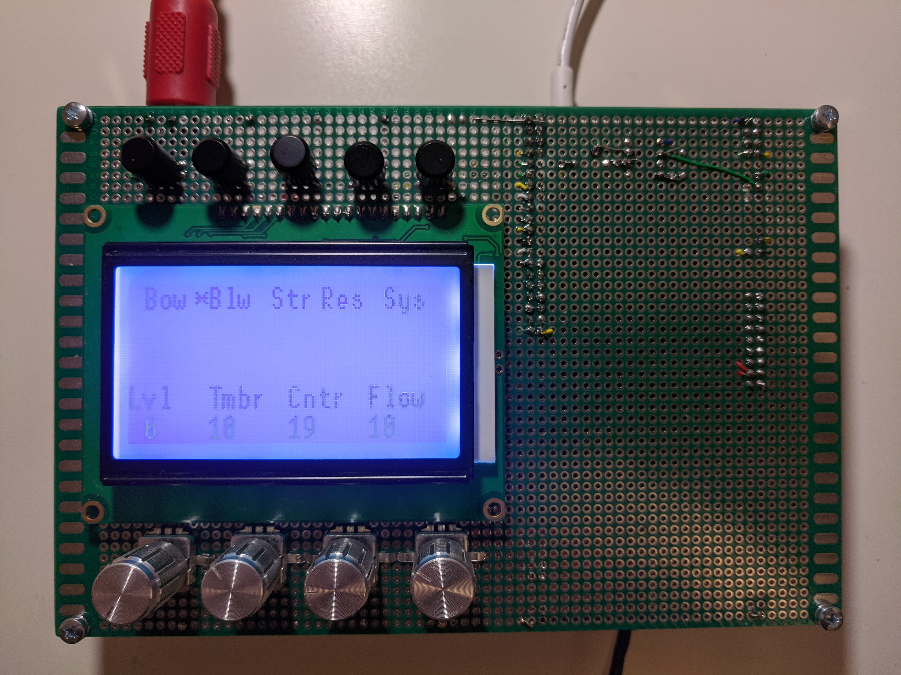
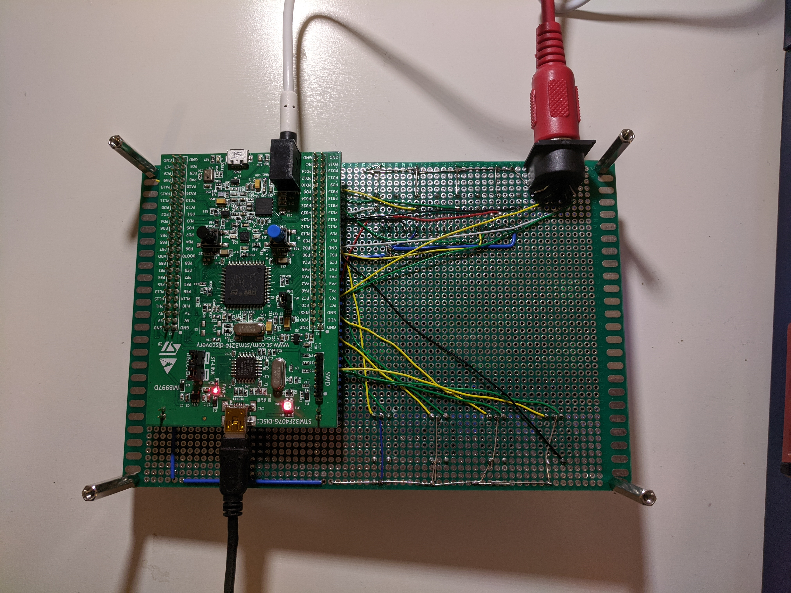

# `MidiElements`

This is a desktop hardware synthesizer based on [Elements](https://mutable-instruments.net/modules/elements/) by [Mutable Instruments](https://mutable-instruments.net/).
MidiElements uses the same synthesis engine and it wraps it in a standalone form factor, so that it can be used without modular environment.

It features:
* MIDI input
* Patch editing using an LCD display, 5 buttons and 4 endless knobs.

## Current status

Note that this is a work-in-progress project so these features are still in development.

But core functionality is there and this can be used for some fun with sounds and of course some hacking.

Building it yourself probably won't be a breeze, but I can help if needed - I want more people to use the product and possibly also help in developing it.

Major limitations are:
* MIDI CC messages are not supported yet;
* MIDI system messages (e.g. SysEx) are also not supported;
* Patch editor user interface is very simple and not very user friendly;
* Sound playback stops for a fraction of second when switching UI pages - this is a workaround to avoid long screen updates (synthesis is ocuppying most of CPU time);
* Patch load/store is not implemented yet.

## Hardware

Current prototype is quite simple to build. You will need
* A universal prototyping board, a breadboard can be also used for zero soldering approach;
* [STM32F407 discovery board](https://www.st.com/en/evaluation-tools/stm32f4discovery.html);
* A graphical display - LCD12864 or another using ST7920 controller. These are pretty cheap and can be found on AliExpress or elsewhere;
* 4 endless rotary encoders. preferably 32 ticks per full rotation, plus caps;
* 5 tacticle switches, plus caps
* MIDI port - ok, this is a bit more complicated, as you need a DIN5 socket, 6N137 IC, 2 resistor and a diode. I have based my prototype on
the design in Mutable Elements [Shruthi](https://mutable-instruments.net/archive/shruthi/build/),
see the [schematics](https://mutable-instruments.net/archive/schematics/Shruthi-Digital-v08.pdf).
An Arduino/etc shield e.g. from [Sparkfun](https://www.sparkfun.com/products/12898) can be also be used.

The build is simple - just connect all these peripherals to the discovery board. :)
There is no schematics for that, just use the [list of connections](https://docs.google.com/spreadsheets/d/1-rX1TQSrHYOQDU-ax9JT7t3ar4qHqWEwtwwP0Y1XQPY/edit?usp=sharing).

My prototype does not look very pro :) but it works just fine:
* 
* 

## Firmware

The descriptions below may be too brief depending on your experience with STM32. I probably should invest some time in better explanations. In the meantime, don't hesitate to ask if you are in trouble.

### Tools

You will need some tools to build and run the firmware on the STM32 board:
* ARM EABI toolchain to build the Elements library.
  * Version [4.8-2013-q4-major](https://launchpad.net/gcc-arm-embedded/4.8/4.8-2013-q4-major/) is recommended.
  * Some more hints on [Mutable Instruments open source page](https://mutable-instruments.net/modules/elements/open_source/)
* Rust toolchain.
  * Follow the instructions in [The Embedded Rust Book](https://rust-embedded.github.io/book/intro/install.html). Note to install the thumbv7em-none-eabihf target.
* Openocd or another ST-LINK tool to flash the board (and debug)

### Build

This is a 3-step process:
* Get stmlib submodule
```
git submodule init && git submodule update
```
* Build Elements library
```
make -f elements\makefile lib
```
* Build the main binary
```
cd mutmidi
cargo build
```

### Run

For quick hacking, the easiest is to do:
```
cd mutmidi
cargo run --release
```
Then type 'c' in gdb prompt.

You'll need openocd running in background. And of course the board has to be connected via USB (the mini-USB connector is ST-LINK interface).
Next time you can just power on the board via USB, firmware will be flashed.

Check [The Embedded Rust Book](https://rust-embedded.github.io/book/start/hardware.html) for more help.

## Plans

In progress:
* Complete MIDI implementation

Short-term:
* Patches storage
* Basic configuration as needed, e.g. midi channel
* Improve visuals and usability of the user interface, as much as performance allows

Long-term wishlist:
* Modulation sources and matrix for all synthesis parameters
* Optimization of display updates to fix the need to pause synth during screen change (use DMA and/or connect via parallel interface)
* Hardware: proper PCB
* Hardware: MIDI thru connector
* Upgrade to more powerful hardware (STM32H7)
* Polyphony, 3-4 voices should be possible on STM32H7
* Fork the project to use Mutable Instruments Plaits synthesis

## License

This software and hardware is released under [The GNU General Public License v3.0](https://www.gnu.org/licenses/gpl-3.0.en.html) or later.
